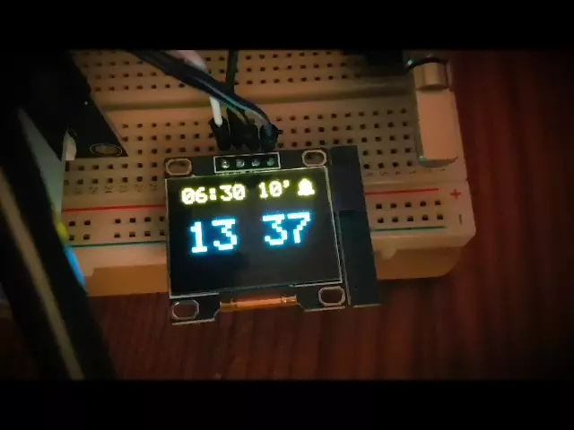

# Sunrise Alarm Clock
An arduino project for not having to wake up in a dark room during winter.

## How to build
### Parts
* Arduino Uno
* Rotary Encoder with button (or extra button)
* I2C OLED Module SSD1306 128*64px
* AC Dimmer Module (mine is made by [RobotDyn](https://robotdyn.com/ac-light-dimmer-module-1-channel-3-3v-5v-logic-ac-50-60hz-220v-110v.html))

### Wiring
Have a look at the Fritzing file. There is also a written description at the top of the sketch which I am going to repeat here:
* Rotary encoder setup:
  * Attach a pins CLK and DT to A2 and A3.
  * Attach SW pin to digital pin 7 (SW_PIN)
  * GND to GND, + to 3.3V
* OLED setup (I2C):
  * SCL, SDA to SCL, SDA
  * GND to GND, VCC to 3.3V
* AC Dimmer Setup
  * PWM to Pin 4 (AC_LOAD)
  * ZeroCrossing to Pin 2 (hardcoded in RBDDimmer.h due to hardware timer)
  * GND to GND, VCC to 3.3V

## How to use
Again, take a look at the description at the top of the sketch or read on:
* The encoder with its button is the only interface to the arduino.
* The UI has two main views, main (displays time) and edit (to set time and alarm). 
* To switch between these views, long press the button
* Main view encoder bindings:
  * single click: turn light on or off
  * double click: (de)activate alarm
  * rotation: change brightness of light (only when light is on)
* Edit view encoder bindings:
  * single click: switch to the next unit to edit
  * double click: switch between editing the alarm and editing the time
  * rotation: change the value of the currently editable unit

**Note:** The lamp will turn on _before_ the alarm time and increase to full brightness.

## Screen Capture
